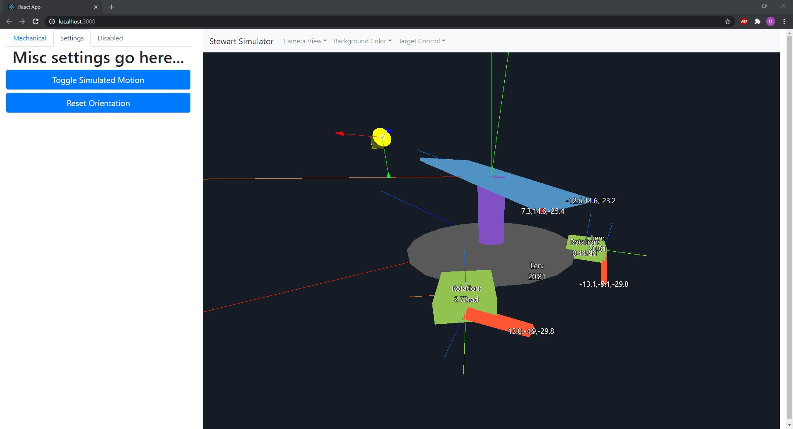

# 3dof-stewart-simulator

An interactive graphical simulator for the inverse kinematics of a 3DOF stewart platform.



## Quickstart

```bash
git clone https://github.com/dcyoung/3dof-stewart-simulator.git

cd 3dof-stewart-simulator

yarn upgrade
yarn start

# or alternatively
npm install
npm start
```
